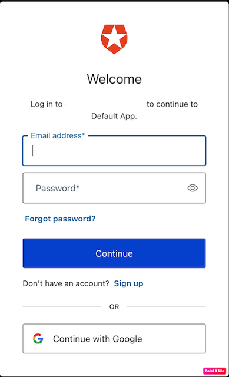

# Boat-and-Load-Tracker

Welcome to the Boat and Load Tracker API!

## Table of Contents
  - [Overview](#overview)
  - [App File Structure](#app-file-structure)
  - [Features](#features)
  - [Screenshots](#screenshots)
  - [Technologies Used](#technologies-used)
  - [Installation and Operation](#installation-and-operation)
    - [Option 1:](#option-1)
    - [Option 2:](#option-2)
## Overview

The Boat and Load Tracker is a supply chain API that allows a user to perform various interdependent Create, Read, Update and Delete (CRUD) operations on entities such as Owners, Boats and Loads. Secure access is to the API is implemeted with Auth0. API documentation is included which details endpoint calls and responses.

## App File Structure
The following is a brief overview of the file structure

[./API documentation.pdf](https://github.com/voyagerfan/Boat-and-Load-Tracker/blob/main/API%20documentation.pdf) - Describes API endpoint calls & responses

[./templates](https://github.com/voyagerfan/Boat-and-Load-Tracker/tree/main/templates) - Home screen for API login

[./boats.py](https://github.com/voyagerfan/Boat-and-Load-Tracker/blob/main/boats.py) - Route handler for boat endpoints

[./loads.py](https://github.com/voyagerfan/Boat-and-Load-Tracker/blob/main/loads.py) - Route handler for load endpoints

[./owner.py](https://github.com/voyagerfan/Boat-and-Load-Tracker/blob/main/owner.py) - Route handler for owner enpoint

## Features

This API includes the following features: 
* A homescreen to authentic new and current users with Auth0. 
* Bearer token is issued from Auth0 and is used to securely perform CRUD operations for JWT protected endpoints (endpoints associated with an owner)
* All entities are stored in Google Datastore (Owners, Boats and Loads)
* [API documentation](https://github.com/voyagerfan/Boat-and-Load-Tracker/blob/main/API%20documentation.pdf)
* Postman collection included for testing.
* REST architecture for scalability, flexibility simplicity and ease of use. 

## Screenshots
Welcome Screen

Auth0 Login Screen

Callback screen with JWT infomation

## Technologies Used

- **Programming Languages:** Python, Javascript, HTML
- **Frameworks:** Flask-RESTful
- **API testing:** Postman
- **Access Management:** Auth0

## Installation and Operation

### Option 1:
You may make API calls using the host URL (listed in resume) and endpoints (listed in the documentaion) with a method of your choosing. Please keep in mind that the request header will require your bearer token. Retrieve your bearer token using Option 2, section 3.1 - 3.3.

Example of a post request using Python:

### Option 2:
Prerequisites: <a href="https://www.postman.com/downloads" target="_blank">Postman</a>

Once you have downloaded Postman:
1. Configure the Postman environment
   1. Download the Postman environment <a href="https://github.com/voyagerfan/Boat-and-Load-Tracker/blob/main/Postman_Files/boatAPI.postman_environment.json" target="_blank">Environment File</a> 
   2. Open Postman, click on the **Environments** tab on the left side
   3. Drag the downloaded environment file into the environment pane of Postman.
   4. In the top right corner of the application window, there may be a dropdown menu that says "No Environment". Click this dropdown and select the environment that was added.
2. Add the Postman Collection
   1. Download the Postman Collection <a href="https://github.com/voyagerfan/Boat-and-Load-Tracker/blob/main/Postman_Files/BoatAPI.postman_collection.json" target="_blank">Collection File</a> 
   2. Click on the **Collections** tab on the left side of the Postman application.
   3. Drag the downloaded collection file into the Postman collections pane
3. Retrieve a Bearer token
   1. Access the API login page (see resume for URL)
   2. Following the instructions, you will be re-routed to Auth0 to login or create a new user account.
   3. After successful login, you will be redirected to the back to the API login page. Your bearer token will be displayed under "Encoded JWT". **Please copy this bearer token**
4. Add the App URL your Bearer token to the Postman environment
   1. Open the enviroments tab in Postman
   2. Double click on the environment tab.
   3. Add your Bearer token to "jwt1" variable in both the current value and initial value fields.
   4. Add the App URL (listed in the resume) to the "app_url" variable in both the current value and initial value fields.
5. Run the collection
   1. Click on the collections tab on the left pane
   2. right click on the collection and select "run collection.

